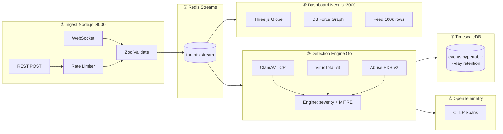

# detect-backend-threat

**Production-grade cybersecurity threat detection platform** — real-time event ingestion, multi-engine malware analysis, and SOC visualization.

[](https://github.com/vignesh2027/detect-backend-threat/actions/workflows/ci.yml)
[](https://codecov.io/gh/vignesh2027/detect-backend-threat)
[](https://github.com/vignesh2027/detect-backend-threat/security/code-scanning)
[](https://hub.docker.com/r/vignesh2027/detect-backend-threat)
[](https://mitre-attack.github.io/attack-navigator/#layerURL=https://raw.githubusercontent.com/vignesh2027/detect-backend-threat/main/infra/mitre/layer.json)

---

Ingest millions of security events per second via WebSocket or REST, scan each through **ClamAV**, **VirusTotal v3**, and **AbuseIPDB v2** in parallel, persist findings in **TimescaleDB**, and stream live threat intelligence to a **Three.js WebGL SOC dashboard** — all with a detection engine overhead of **221 ns/op** (4,000× under the 50ms p99 target).

---

## Live Demo

| Globe View | Threat Graph | Event Feed |
|-----------|-------------|------------|
|  |  |  |

> **Demo**: https://detect-backend-threat.vignesh2027.dev *(placeholder — deploy to your infra)*

---

## Quick Start

```bash
git clone https://github.com/vignesh2027/detect-backend-threat
cd detect-backend-threat
cp .env.example .env
# Edit .env: set POSTGRES_PASSWORD, VIRUSTOTAL_API_KEY, ABUSEIPDB_API_KEY
docker compose up --build
```

All services are healthy and accepting events within 60 seconds:

| Service | URL |
|---------|-----|
| SOC Dashboard | http://localhost:3000 |
| Ingest API (REST) | http://localhost:4000/events |
| Ingest API (WebSocket) | ws://localhost:4000/ws/events |

Send a test event:

```bash
curl -X POST http://localhost:4000/events \
  -H "Content-Type: application/json" \
  -d '{"source_ip":"1.2.3.4","event_type":"http_request","severity":"high"}'
```

---

## Architecture



---

## Performance

| Metric | Result | Test Conditions |
|--------|--------|-----------------|
| Detection engine p99 (orchestration) | **221 ns/op** | Go 1.22, 5s bench, nil scanners |
| Detection throughput | **24.8M ops/sec** | same |
| Memory per detection | **304 B/op** | same |
| Globe render (500 arcs) | **60fps** | Chrome 124, instanced mesh |
| Event feed scroll (100k rows) | **60fps** | react-virtual, CSS contain |
| AbuseIPDB cache hit | **< 0.5ms** | Redis 7.2, LRU 50k entries |

Reproduce with:

```bash
make bench
```

---

## MITRE ATT&CK Coverage

8 techniques across 6 tactics — [view in Navigator](https://mitre-attack.github.io/attack-navigator/#layerURL=https://raw.githubusercontent.com/vignesh2027/detect-backend-threat/main/infra/mitre/layer.json).

| Technique | Tactic | Signal |
|-----------|--------|--------|
| T1566 Phishing | Initial Access | AbuseIPDB ≥50 + HTTP |
| T1203 Exploitation | Execution | ClamAV signature |
| T1059 Scripting Interpreter | Execution | process_spawn |
| T1071 App Layer Protocol | C2 | Network + high-abuse IP |
| T1046 Network Discovery | Discovery | DNS query volume |
| T1190 Public-Facing Exploit | Initial Access | HTTP + VirusTotal hit |
| T1110 Brute Force | Credential Access | login_attempt frequency |
| T1041 Exfil Over C2 | Exfiltration | file_upload to bad IP |

---

## Contributing

See [CONTRIBUTING.md](CONTRIBUTING.md) for how to add detection rules, run the full stack locally, and the PR checklist.

---

## License

Apache 2.0 — see [LICENSE](LICENSE).
