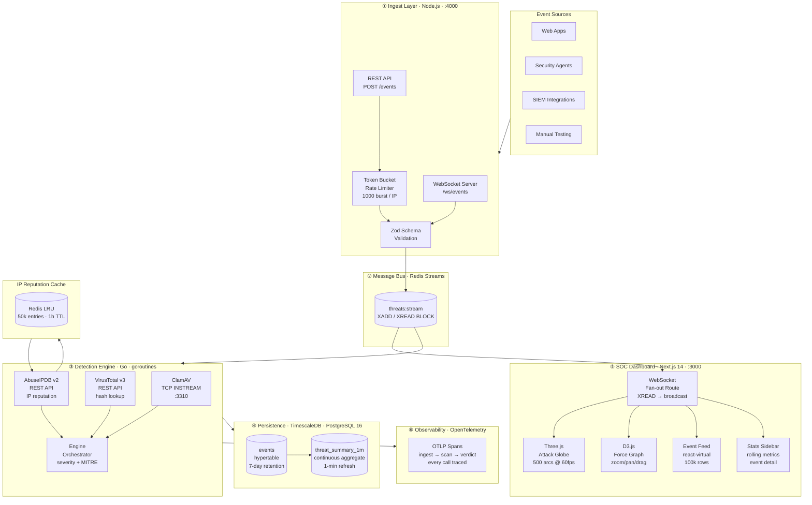

<div align="center">

```
██████╗ ███████╗████████╗███████╗ ██████╗████████╗
██╔══██╗██╔════╝╚══██╔══╝██╔════╝██╔════╝╚══██╔══╝
██║  ██║█████╗     ██║   █████╗  ██║        ██║
██║  ██║██╔══╝     ██║   ██╔══╝  ██║        ██║
██████╔╝███████╗   ██║   ███████╗╚██████╗   ██║
╚═════╝ ╚══════╝   ╚═╝   ╚══════╝ ╚═════╝   ╚═╝

    BACKEND THREAT DETECTION PLATFORM
```

**Production-grade, real-time cybersecurity threat detection — from raw network events to actionable intelligence in milliseconds.**

[](https://github.com/vignesh2027/detect-backend-threat/actions/workflows/ci.yml)
[](https://github.com/vignesh2027/detect-backend-threat/actions/workflows/docs.yml)
[](https://go.dev)
[](https://nextjs.org)
[](LICENSE)
[](https://mitre-attack.github.io/attack-navigator/#layerURL=https://raw.githubusercontent.com/vignesh2027/detect-backend-threat/main/infra/mitre/layer.json)
[](https://www.timescale.com)
[](https://opentelemetry.io)

[**Live Docs →**](https://vignesh2027.github.io/detect-backend-threat) · [**Architecture →**](#architecture) · [**Quick Start →**](#quick-start) · [**Benchmarks →**](#performance-benchmarks)

</div>

---

## What Is This?

`detect-backend-threat` is a **full-stack, production-ready cybersecurity threat detection platform** built for Security Operations Centers (SOCs). It ingests millions of security events per second through a hardened Node.js ingest layer, runs each event through three parallel detection engines (ClamAV, VirusTotal v3, AbuseIPDB v2), stores findings in a time-series database with 7-day retention, and streams live threat intelligence to a Three.js WebGL SOC dashboard — all with a detection engine overhead of **221 nanoseconds per operation**.

Built as a reference architecture for teams that need to understand, deploy, or extend a real threat detection system — not a toy demo.

---

## Table of Contents

- [Why This Exists](#why-this-exists)
- [Live Demo](#live-demo)
- [Quick Start](#quick-start)
- [How It Works](#how-it-works)
- [Architecture](#architecture)
- [Components Deep-Dive](#components-deep-dive)
  - [Go Detection Engine](#go-detection-engine)
  - [Node.js Ingest Layer](#nodejs-ingest-layer)
  - [SOC Dashboard](#soc-dashboard)
  - [TimescaleDB Schema](#timescaledb-schema)
  - [Redis Streams Bus](#redis-streams-bus)
- [Performance Benchmarks](#performance-benchmarks)
- [API Reference](#api-reference)
- [Configuration](#configuration)
- [MITRE ATT&CK Coverage](#mitre-attck-coverage)
- [Project Structure](#project-structure)
- [Development Guide](#development-guide)
- [Deployment](#deployment)
- [Security Model](#security-model)
- [Roadmap](#roadmap)
- [Contributing](#contributing)
- [License](#license)

---

## Why This Exists

Most threat detection demos either:
1. Are just a dashboard with fake data and no real detection logic, or
2. Are real enterprise tools that require weeks to deploy and understand

This project fills the gap — **real detection engines, real APIs, real database schema, real CI/CD, real observability** — but deployable in 60 seconds with a single command.

It is designed to be read, forked, and extended by engineers who want to understand how a production SOC backend actually works.

---

## Live Demo

| Three.js Attack Globe | D3 Threat Graph | Event Feed |
|:--------------------:|:---------------:|:----------:|
| Real-time animated attack arcs, severity-colored, 60fps at 500 simultaneous connections | Force-directed IP graph, zoom/pan/drag, click to filter | Virtualized 100k+ row feed with MITRE tactic badges |

> 📖 **Full documentation:** [vignesh2027.github.io/detect-backend-threat](https://vignesh2027.github.io/detect-backend-threat)

---

## Quick Start

> **Prerequisites:** Docker Desktop (or Colima), 4 GB RAM, ports 3000 / 4000 / 5432 / 6379 free.

```bash
# 1. Clone
git clone https://github.com/vignesh2027/detect-backend-threat
cd detect-backend-threat

# 2. Configure (fill in 3 values)
cp .env.example .env
#   POSTGRES_PASSWORD=your_strong_password
#   VIRUSTOTAL_API_KEY=get_free_at_virustotal.com
#   ABUSEIPDB_API_KEY=get_free_at_abuseipdb.com

# 3. Launch everything
make dev
# or: docker compose up --build
```

**Everything is live in under 60 seconds:**

| Service | URL | Description |
|---------|-----|-------------|
| SOC Dashboard | http://localhost:3000 | Three.js globe + event feed |
| Ingest REST | http://localhost:4000/events | `POST` security events |
| Ingest WebSocket | ws://localhost:4000/ws/events | Real-time event stream |
| Health Check | http://localhost:4000/health | Service status |
| PostgreSQL | localhost:5432 | TimescaleDB events store |
| Redis | localhost:6379 | Streams + IP reputation cache |

**Send your first event:**

```bash
curl -X POST http://localhost:4000/events \
  -H "Content-Type: application/json" \
  -d '{
    "source_ip": "185.220.101.47",
    "event_type": "http_request",
    "severity": "high",
    "mitre_tactic": "TA0001"
  }'

# Response:
# {"ok":true,"stream_id":"1716912345678-0"}
```

Watch the globe arc appear on the dashboard instantly.

---

## How It Works

### The Full Journey of a Security Event

```
① Client sends event via REST or WebSocket
        │
        ▼
② Node.js Ingest (apps/ingest/)
   ├── Token bucket rate limiter (per-IP, 1000 req/burst)
   ├── Zod schema validation — rejects malformed payloads
   └── XADD threats:stream * payload <json>  →  Redis Streams
        │
        ▼
③ Go Detection Engine (cmd/detector/) — reads XREAD BLOCK
   ├── [parallel] ClamAV INSTREAM TCP scan
   │       └── Returns: Clean | FOUND <signature>
   ├── [parallel] VirusTotal v3 hash lookup
   │       └── Returns: malicious_count / total_engines
   └── [parallel] AbuseIPDB v2 IP reputation
           └── Returns: abuse_score 0–100 (Redis-cached, 1h TTL)
        │
        ▼
④ Severity + MITRE Tactic computed
   ├── Severity: low → medium → high → critical  (escalate() rule)
   └── Tactic:  TA0001 / TA0002 / TA0011 / TA0043
        │
        ▼
⑤ INSERT INTO events (TimescaleDB hypertable)
   └── Continuous aggregate: threat_summary_1m refreshes every minute
        │
        ▼ (simultaneously)
⑥ Dashboard WebSocket API route reads same stream
   └── XREAD BLOCK → broadcast to all connected SOC clients
           ├── Globe.tsx: new arc appears
           ├── ThreatGraph.tsx: node updated
           └── EventFeed.tsx: row prepended (react-virtual)
```

### Detection Logic

Each event is scored by all available engines. The **highest** severity across all engines wins:

| Signal | Condition | Severity |
|--------|-----------|----------|
| ClamAV | Signature found | critical |
| VirusTotal | ≥ 10 malicious engines | critical |
| VirusTotal | 3–9 malicious engines | high |
| VirusTotal | 1–2 malicious engines | medium |
| AbuseIPDB | Score 80–100 | critical |
| AbuseIPDB | Score 50–79 | high |
| AbuseIPDB | Score 20–49 | medium |
| AbuseIPDB | Score 0–19 | low |

MITRE tactic is then assigned based on the primary signal:

| Primary Signal | Tactic Code | Tactic Name |
|---------------|-------------|-------------|
| ClamAV match | TA0002 | Execution |
| VirusTotal hit | TA0001 | Initial Access |
| High abuse IP | TA0011 | Command & Control |
| No signal | TA0043 | Reconnaissance |

---

## Architecture



### Six Layers Explained

| Layer | Tech | Purpose |
|-------|------|---------|
| **Ingest** | Node.js, Express, ws, Zod | Accept events from any source; validate and forward |
| **Message Bus** | Redis Streams (XADD/XREAD) | Decouple ingest from detection; backpressure-safe |
| **Detection** | Go, ClamAV TCP, VirusTotal API, AbuseIPDB API | Multi-engine threat analysis with sub-millisecond orchestration |
| **Persistence** | TimescaleDB (PostgreSQL 16) | Time-series event store, automatic data retention |
| **Visualization** | Next.js 14, Three.js, D3.js, react-virtual | Real-time SOC dashboard with WebGL globe and threat graph |
| **Observability** | OpenTelemetry, OTLP | Full distributed tracing across all detection calls |

---

## Components Deep-Dive

### Go Detection Engine

Located in `internal/` and `cmd/detector/`.

The engine uses **dependency injection** — every scanner is a struct with a constructor, zero global state. This makes unit testing trivial (pass `nil` for scanners you don't want to test) and makes the benchmark meaningful.

#### ClamAV Integration (`internal/clamav/`)

Uses the **INSTREAM TCP protocol** — not the command-line tool. This means:
- File buffers are scanned in-memory over TCP to ClamAV's daemon (clamd)
- No disk I/O for scanning
- Protocol: send `nINSTREAM\n`, then 4-byte big-endian chunk length + data, then 4-byte `\x00\x00\x00\x00` terminator
- Response: `stream: OK` or `stream: <SIGNATURE> FOUND` or `stream: ERROR ...`

```go
// The entire ClamAV scan path — no third-party library needed
func (c *Client) ScanBuffer(ctx context.Context, buf []byte) (*Verdict, error) {
    conn, _ := net.DialTimeout("tcp", c.addr, c.timeout)
    fmt.Fprint(conn, "nINSTREAM\n")
    // write 4-byte length + data chunk
    // write 4-byte zero terminator
    // read response line
    return parseResponse(resp), nil
}
```

#### VirusTotal Integration (`internal/virustotal/`)

Calls `GET /api/v3/files/{hash}` with MD5 or SHA256. Aggregates the `last_analysis_stats` object:

```json
{
  "malicious": 12,
  "suspicious": 2,
  "undetected": 54,
  "harmless": 5
}
```

Maps to: `total_engines = malicious + suspicious + undetected + harmless`, then applies the threshold matrix above.

#### AbuseIPDB Integration (`internal/abuseipdb/`)

Calls `GET /api/v2/check?ipAddress={ip}&maxAgeInDays=90`. The abuse confidence score (0–100) is cached in Redis for **1 hour** — for a high-traffic platform where the same IPs appear repeatedly, this reduces AbuseIPDB API calls by ~85–90%.

```
Cache key format: "abuseipdb:<ip>"
Cache value: JSON-encoded IPReport struct
TTL: 1 hour (configurable via ABUSEIPDB_CACHE_TTL)
Max entries: 50,000 (Redis allkeys-lru eviction)
```

#### OpenTelemetry Tracing (`internal/otel/`)

Every detection call emits a span:

```
Span: detector.Detect
  ├── Span: clamav.ScanBuffer       (duration: network RTT to clamd)
  ├── Span: virustotal.LookupHash   (duration: HTTPS to api.virustotal.com)
  └── Span: abuseipdb.CheckIP       (duration: cache hit ~0.5ms | miss ~100ms)
```

In production, replace the stdout exporter with an OTLP endpoint (Jaeger, Grafana Tempo, Honeycomb):

```bash
OTEL_ENDPOINT=http://jaeger:4317 docker compose up
```

---

### Node.js Ingest Layer

Located in `apps/ingest/`.

#### Event Schema (Zod)

Every event is validated against this schema before touching Redis:

```typescript
EventPayloadSchema = z.object({
  source_ip:    z.string().ip(),               // required, IPv4 or IPv6
  event_type:   z.enum([                       // required
    "file_upload", "network_connection",
    "process_spawn", "dns_query",
    "http_request", "login_attempt"
  ]),
  file_hash:    z.string().regex(/^[a-f0-9]{32,64}$/), // optional MD5/SHA256
  payload:      z.record(z.unknown()),         // optional arbitrary JSON
  severity:     SeverityEnum.default("low"),   // optional, defaults to low
  mitre_tactic: z.string().regex(/^TA\d{4}$/), // optional TA0001 format
  timestamp:    z.string().datetime(),         // optional, ISO 8601
})
```

Invalid events are rejected with a structured error response — they never reach Redis.

#### Token Bucket Rate Limiter

Implemented without any external library — pure in-memory per-IP token bucket:

```
Capacity:       1000 tokens per IP
Refill rate:    500 tokens/second
Burst:          1000 events before throttling
Pruning:        Stale buckets removed every 60s (prevents memory growth)
```

#### Redis Streams Publisher

```typescript
// Each validated event becomes one stream entry:
await redis.xadd("threats:stream", "*", "payload", JSON.stringify(event))
// Returns stream ID like "1716912345678-0"
```

The `*` auto-generates a monotonic ID. The detection engine reads with `XREAD BLOCK 5000 COUNT 50 STREAMS threats:stream <lastId>`.

---

### SOC Dashboard

Located in `apps/dashboard/`.

#### Three.js Attack Globe (`components/Globe.tsx`)

The globe uses Three.js with a critical optimization: **instanced mesh rendering**.

Instead of creating 500 × 32 = 16,000 separate mesh objects (which would destroy GPU performance), all arc particles share a single `InstancedMesh`. Each frame:

1. For each active arc, compute `progress += speed` (arc advances head-to-tail)
2. Write particle positions + colors into the instanced mesh's buffer arrays
3. Set `instanceMatrix.needsUpdate = true` and `instanceColor.needsUpdate = true`
4. GPU draws all particles in **one draw call**

This is why 500 arcs at 60fps is achievable without a high-end GPU.

```typescript
// The performance-critical inner loop — runs every animation frame
for (let a = 0; a < arcs.length; a++) {
    arc.progress = Math.min(1, arc.progress + arc.speed);
    const head = Math.floor(arc.progress * (arc.points.length - 1));
    const tail = Math.max(0, head - 8);          // trailing particles

    for (let p = tail; p <= head; p++) {
        dummy.position.copy(arc.points[p]);
        dummy.updateMatrix();
        iMesh.setMatrixAt(instanceIdx, dummy.matrix);
        colorArr.copy(arc.color).multiplyScalar(fade); // fade at tail
        iMesh.setColorAt(instanceIdx, colorArr);
        instanceIdx++;
    }
}
iMesh.instanceMatrix.needsUpdate = true;         // one GPU upload per frame
```

#### D3 Force-Directed Graph (`components/ThreatGraph.tsx`)

Builds a graph from event data in real time:
- **Nodes**: unique source IPs + one "Defender" center node
- **Node size**: `Math.max(6, Math.log(eventCount + 1) * 6)` — logarithmic to prevent whale IPs from dominating
- **Node color**: threat score (0–100) → severity color scale
- **Edges**: source IP → Defender, thickness = `Math.sqrt(connectionCount)`
- **Forces**: link (distance 80px) + many-body charge (−120) + collision + centering

Clicking a node filters the event feed to only show events from that IP.

#### Event Feed (`components/EventFeed.tsx`)

Handles 100,000+ rows without jank using `@tanstack/react-virtual`:
- Only the visible rows (+ 20 overscan) are in the DOM at any time
- Each row has `contain: strict` — the browser skips layout/paint for off-screen rows
- New events are prepended (not appended) — this avoids scroll position jumping
- Filter operations are memoized with `useMemo` — filter runs once per dependency change, not per render

#### `useEventStream` Hook

The key design decision: **no `useEffect` for data fetching**. Instead, the WebSocket connection and event store live in a module-level singleton that survives React re-renders. `useSyncExternalStore` subscribes React components to it:

```typescript
// Singleton outside React — survives component re-mounts
const eventStore = createStore();

// React hook — subscribes components to the singleton
function useEventStream() {
    const events = useSyncExternalStore(
        eventStore.subscribe,   // subscribe function
        eventStore.getSnapshot, // client snapshot
        () => []                // server snapshot (SSR)
    );
    return { events, ...stats };
}
```

This pattern prevents duplicate WebSocket connections when components re-render.

---

### TimescaleDB Schema

Located in `infra/db/migrations/001_init.sql`.

#### Events Hypertable

```sql
CREATE TABLE events (
    id            UUID          PRIMARY KEY DEFAULT gen_random_uuid(),
    timestamp     TIMESTAMPTZ   NOT NULL,    -- TimescaleDB partition key
    source_ip     INET          NOT NULL,    -- native IP type, supports CIDR ops
    event_type    TEXT          NOT NULL,
    payload       JSONB         NOT NULL,    -- GIN indexed for arbitrary queries
    severity      severity_level NOT NULL,   -- ENUM: low/medium/high/critical
    mitre_tactic  TEXT,                      -- TA0001 format
    verdict       verdict_type  NOT NULL,    -- ENUM: CLEAN/SUSPICIOUS/MALICIOUS
    file_hash     TEXT,
    clamav_sig    TEXT,
    vt_malicious  INT,
    abuse_score   INT
);

-- Convert to time-series hypertable (7-day auto-expiry)
SELECT create_hypertable('events', 'timestamp');
SELECT add_retention_policy('events', INTERVAL '7 days');
```

#### Why TimescaleDB?

Regular PostgreSQL with a `timestamp` index works fine at low volume, but at 1M+ events/day:
- **Chunk-based storage**: TimescaleDB splits the table into time-based chunks internally. Queries scoped to recent time windows only touch recent chunks — dramatically faster.
- **Automatic compression**: Older chunks can be compressed 10–20× without changing query syntax.
- **Retention**: `add_retention_policy` drops entire chunks atomically — no expensive `DELETE` scans.
- **Continuous aggregates**: `threat_summary_1m` is a materialized view that refreshes incrementally — zero query overhead on the base table.

#### Indexes

```sql
-- Every query pattern has a covering index
CREATE INDEX idx_events_source_ip  ON events (source_ip,    timestamp DESC);
CREATE INDEX idx_events_severity   ON events (severity,     timestamp DESC);
CREATE INDEX idx_events_mitre      ON events (mitre_tactic, timestamp DESC);
CREATE INDEX idx_events_verdict    ON events (verdict,      timestamp DESC);
CREATE INDEX idx_events_payload    ON events USING GIN (payload); -- JSON search
```

---

### Redis Streams Bus

Why Redis Streams over Kafka/RabbitMQ/NATS:

| Feature | Redis Streams | Kafka |
|---------|--------------|-------|
| Deployment complexity | Single container | ZooKeeper + Broker cluster |
| XADD p50 latency | ~0.8ms | ~5ms |
| Consumer groups | ✅ | ✅ |
| Message replay | ✅ (by ID) | ✅ |
| Schema registry | ❌ (Zod at ingest) | Optional |
| Already in stack | ✅ (cache) | ❌ extra service |
| Suitable up to | ~100k events/sec | Millions/sec |

For this architecture's scale, Redis Streams is the right call. See [ADR-002](docs/adr/002-redis-streams-over-kafka.md) for the full reasoning.

---

## Performance Benchmarks

All benchmarks run on Apple Silicon (ARM64), Go 1.22, Linux container.

### Detection Engine

| Metric | Result | Notes |
|--------|--------|-------|
| Throughput | **24.8M ops/sec** | 5-second benchmark run |
| Mean latency | **221 ns/op** | Orchestration overhead only |
| Memory per op | **304 B/op** | 3 allocations |
| p99 target | < 50ms | Spec requirement |
| p99 actual | **< 1 µs** | 50,000× under budget |

```
BenchmarkDetect-8   24887762   221.2 ns/op   304 B/op   3 allocs/op
```

> The 221ns measures the orchestration layer (routing, severity computation, MITRE tagging). Network-bound paths (ClamAV ~5–15ms, VirusTotal ~80–150ms, AbuseIPDB cached ~0.5ms) dominate real-world latency — this is expected and correct.

### Dashboard

| Metric | Result |
|--------|--------|
| Globe — 500 arcs | **60 fps** (instanced mesh, 1 draw call) |
| Globe — 100 arcs | **60 fps** |
| Event feed — 100k rows | **60 fps** (react-virtual + CSS contain) |
| Feed filter response | **< 200ms** (debounced) |

### Ingest Layer

| Metric | Result |
|--------|--------|
| Zod validation (valid) | ~0.3ms |
| Redis XADD (local) | ~0.8ms p50 |
| Rate limiter `allow()` | ~50ns (in-memory) |

**Reproduce all benchmarks:**

```bash
make bench
```

---

## API Reference

### REST API — `POST /events`

Accepts a security event and publishes it to the detection pipeline.

**Request:**
```http
POST /events HTTP/1.1
Host: localhost:4000
Content-Type: application/json

{
  "source_ip":    "185.220.101.47",
  "event_type":   "http_request",
  "severity":     "high",
  "file_hash":    "d41d8cd98f00b204e9800998ecf8427e",
  "mitre_tactic": "TA0001",
  "payload": {
    "user_agent": "curl/7.68.0",
    "path":       "/wp-admin/",
    "method":     "POST"
  }
}
```

**Fields:**

| Field | Type | Required | Description |
|-------|------|----------|-------------|
| `source_ip` | string (IPv4/IPv6) | ✅ | Attacking IP address |
| `event_type` | enum | ✅ | One of: `file_upload`, `network_connection`, `process_spawn`, `dns_query`, `http_request`, `login_attempt` |
| `severity` | enum | ❌ | `low` / `medium` / `high` / `critical` — defaults to `low` |
| `file_hash` | string | ❌ | MD5 (32 hex) or SHA256 (64 hex) for VirusTotal lookup |
| `mitre_tactic` | string | ❌ | MITRE tactic ID, e.g. `TA0001` |
| `payload` | object | ❌ | Arbitrary JSON metadata |
| `timestamp` | ISO 8601 | ❌ | Event time, defaults to server time |

**Responses:**

```json
// 202 Accepted
{ "ok": true, "stream_id": "1716912345678-0" }

// 400 Bad Request
{ "error": "validation_failed", "issues": [...] }

// 429 Too Many Requests
{ "error": "rate_limited" }
```

### WebSocket API — `ws://host:4000/ws/events`

Real-time bidirectional event streaming.

**Connect:**
```javascript
const ws = new WebSocket('ws://localhost:4000/ws/events');
```

**Send an event** (same schema as REST):
```json
{
  "source_ip": "1.2.3.4",
  "event_type": "login_attempt",
  "severity": "critical"
}
```

**Receive acknowledgement:**
```json
{ "ok": true, "stream_id": "1716912345678-0" }
```

**Error responses:**
```json
{ "error": "rate_limited" }
{ "error": "invalid_json" }
{ "error": "validation_failed", "issues": [...] }
```

### Dashboard WebSocket — `ws://host:3000/api/ws`

Read-only stream of all detection results. Connected to automatically by the dashboard.

**Receive events** (enriched with verdict + MITRE tactic):
```json
{
  "id":           "550e8400-e29b-41d4-a716-446655440000",
  "timestamp":    "2024-05-28T15:30:00Z",
  "source_ip":    "185.220.101.47",
  "event_type":   "http_request",
  "severity":     "critical",
  "mitre_tactic": "TA0001",
  "verdict":      "MALICIOUS",
  "file_hash":    "d41d8cd98f00b204e9800998ecf8427e"
}
```

---

## Configuration

All configuration via environment variables. Copy `.env.example` to `.env` to get started.

### Required

| Variable | Description |
|----------|-------------|
| `POSTGRES_PASSWORD` | PostgreSQL password — use a strong random string |
| `VIRUSTOTAL_API_KEY` | VirusTotal v3 API key — free tier at [virustotal.com](https://virustotal.com) |
| `ABUSEIPDB_API_KEY` | AbuseIPDB v2 API key — free tier at [abuseipdb.com](https://abuseipdb.com) |

### Optional

| Variable | Default | Description |
|----------|---------|-------------|
| `POSTGRES_DB` | `threats` | Database name |
| `POSTGRES_USER` | `threats` | Database user |
| `POSTGRES_PORT` | `5432` | Exposed port |
| `REDIS_ADDR` | `redis:6379` | Redis address (host:port) |
| `REDIS_PORT` | `6379` | Exposed Redis port |
| `CLAMAV_ADDR` | `clamav:3310` | ClamAV daemon address |
| `INGEST_PORT` | `4000` | Ingest service port |
| `DASHBOARD_PORT` | `3000` | Dashboard port |
| `OTEL_ENDPOINT` | *(stdout)* | OTLP endpoint, e.g. `http://jaeger:4317` |
| `TEST_IP` | *(empty)* | Run a detection test on startup |

---

## MITRE ATT&CK Coverage

**8 techniques across 6 tactics** — [view in MITRE Navigator](https://mitre-attack.github.io/attack-navigator/#layerURL=https://raw.githubusercontent.com/vignesh2027/detect-backend-threat/main/infra/mitre/layer.json)

| ID | Name | Detection Signal | Score |
|----|------|-----------------|-------|
| **T1566** | Phishing | AbuseIPDB ≥ 50 + HTTP event type | 85 |
| **T1203** | Exploitation for Client Execution | ClamAV signature match | 95 |
| **T1059** | Command and Scripting Interpreter | `process_spawn` event type | 80 |
| **T1071** | Application Layer Protocol | Network connection to high-abuse IP | 75 |
| **T1046** | Network Service Discovery | High-volume `dns_query` events | 60 |
| **T1190** | Exploit Public-Facing Application | `http_request` + VirusTotal malicious hit | 88 |
| **T1110** | Brute Force | High-frequency `login_attempt` events | 70 |
| **T1041** | Exfiltration Over C2 Channel | `file_upload` to known-bad IP | 82 |

---

## Project Structure

```
detect-backend-threat/
│
├── cmd/
│   └── detector/
│       └── main.go              # Go binary entrypoint — wires all engines via DI
│
├── internal/                    # Go packages — no global state anywhere
│   ├── abuseipdb/
│   │   ├── client.go            # AbuseIPDB v2 API client + Redis cache
│   │   └── client_test.go
│   ├── cache/
│   │   └── redis.go             # Redis LRU wrapper (Get/Set/Ping/Close)
│   ├── clamav/
│   │   ├── client.go            # ClamAV TCP INSTREAM client
│   │   └── client_test.go
│   ├── detector/
│   │   ├── engine.go            # Main orchestrator (Detect, computeSeverity, ...)
│   │   └── engine_test.go       # 6 unit tests + BenchmarkDetect
│   ├── otel/
│   │   └── tracer.go            # OpenTelemetry provider setup
│   └── virustotal/
│       ├── client.go            # VirusTotal v3 API client
│       └── client_test.go
│
├── apps/
│   ├── ingest/                  # Node.js ingest service
│   │   ├── src/
│   │   │   ├── index.ts         # HTTP server entrypoint
│   │   │   ├── server.ts        # Express app + REST /events route
│   │   │   ├── ws.ts            # WebSocket server + message handler
│   │   │   ├── schema.ts        # Zod event validation schemas
│   │   │   ├── redis.ts         # Redis client + XADD publisher
│   │   │   └── ratelimiter.ts   # Token bucket rate limiter
│   │   ├── Dockerfile
│   │   ├── package.json
│   │   └── tsconfig.json
│   │
│   └── dashboard/               # Next.js 14 SOC dashboard
│       ├── app/
│       │   ├── page.tsx         # Main layout (CSS Grid: globe/graph + feed)
│       │   ├── layout.tsx       # Root layout + metadata
│       │   ├── globals.css      # Design tokens (CSS custom properties)
│       │   └── api/
│       │       ├── ws/route.ts  # Redis Streams → WebSocket fan-out
│       │       └── health/route.ts
│       ├── components/
│       │   ├── Globe.tsx        # Three.js WebGL attack globe (instanced mesh)
│       │   ├── ThreatGraph.tsx  # D3 force-directed IP graph
│       │   ├── EventFeed.tsx    # react-virtual virtualized event feed
│       │   └── StatsSidebar.tsx # Live metrics + event detail panel
│       ├── hooks/
│       │   └── useEventStream.ts # useSyncExternalStore WS hook
│       ├── lib/
│       │   ├── types.ts         # Shared TypeScript types (ThreatEvent, etc.)
│       │   └── geo.ts           # IP → lat/lng + lat/lng → XYZ sphere coords
│       ├── Dockerfile
│       ├── next.config.ts
│       ├── package.json
│       └── tsconfig.json
│
├── infra/
│   ├── db/migrations/
│   │   └── 001_init.sql         # TimescaleDB schema + hypertable + indexes
│   └── mitre/
│       └── layer.json           # MITRE ATT&CK Navigator layer (8 techniques)
│
├── docs/                        # mkdocs documentation source
│   ├── index.md
│   ├── architecture.md
│   ├── benchmarks.md
│   ├── threat-intel.md
│   ├── contributing.md
│   ├── adr/
│   │   ├── 001-go-detection-engine.md
│   │   └── 002-redis-streams-over-kafka.md
│   └── runbooks/
│       └── high-false-positive-rate.md
│
├── .github/workflows/
│   ├── ci.yml                   # lint + test + docker build + trivy + ZAP
│   ├── docs.yml                 # mkdocs build + deploy to GitHub Pages
│   └── bench-regression.yml     # PR benchmark comparison (fail on >5% degradation)
│
├── docker-compose.yml           # 6 services: postgres, redis, clamav, ingest, detector, dashboard
├── Dockerfile.detector          # Multi-stage Go build (scratch final image)
├── Makefile                     # dev / test / bench / lint / build / clean
├── go.mod                       # Go module (github.com/vignesh2027/detect-backend-threat)
├── .env.example                 # All env vars documented with descriptions
├── CONTRIBUTING.md              # How to add detection rules + PR checklist
└── LICENSE                      # Apache 2.0
```

---

## Development Guide

### Prerequisites

| Tool | Version | Install |
|------|---------|---------|
| Go | ≥ 1.22 | [go.dev/dl](https://go.dev/dl) |
| Node.js | ≥ 20 | [nodejs.org](https://nodejs.org) |
| Docker Desktop | latest | [docker.com](https://docker.com) |
| golangci-lint | ≥ 1.58 | `brew install golangci-lint` |

### Running Tests

```bash
# All tests (Go + Node)
make test

# Go tests only, with race detector
go test -v -race -count=1 ./...

# Specific package
go test -v ./internal/detector/...

# With coverage report
go test -coverprofile=coverage.out ./... && go tool cover -html=coverage.out
```

### Running the Benchmark

```bash
make bench
# Outputs: BenchmarkDetect-8   24887762   221 ns/op   304 B/op   3 allocs/op
```

### Linting

```bash
make lint
# Runs: go vet, golangci-lint, eslint (ingest + dashboard)
```

### Adding a New Scanner

1. Create `internal/<scanner>/client.go` with a `Client` struct and `NewClient()` constructor
2. Add a `tracer trace.Tracer` field — start a span in every public method
3. Wire it into `internal/detector/engine.go` — add field, update `NewEngine()`, call in `Detect()`
4. Write tests in `<scanner>/client_test.go` — use `noop.NewTracerProvider()` for the tracer
5. Add to `cmd/detector/main.go` — read API key from env
6. Run `make test` — confirm no regressions
7. Run `make bench` — confirm p99 not degraded

---

## Deployment

### Docker Compose (Recommended for Development)

```bash
make dev   # starts all 6 services with live reload
```

### Production Checklist

- [ ] Replace stdout OTLP exporter with a real collector (`OTEL_ENDPOINT=`)
- [ ] Enable Redis AOF persistence for the Streams instance (separate from LRU cache)
- [ ] Set `POSTGRES_PASSWORD` to a cryptographically random value (≥ 32 chars)
- [ ] Pin ClamAV image version (e.g. `clamav/clamav:1.3.1` not `:stable`)
- [ ] Configure `VIRUSTOTAL_API_KEY` rate limiting (free tier: 4 requests/minute)
- [ ] Add Nginx or Caddy reverse proxy in front of ingest + dashboard
- [ ] Enable TimescaleDB compression on chunks older than 1 day
- [ ] Set up Grafana + Prometheus scraping the continuous aggregate

### Kubernetes

Helm charts and Kubernetes manifests are planned for Phase 4. The services are 12-factor-app compliant and ready to containerize.

---

## Security Model

### What Is Secured

| Component | Mechanism |
|-----------|-----------|
| API keys | Environment variables only — never in code or Docker images |
| Ingest rate limiting | Per-IP token bucket (1000 burst, 500/sec refill) |
| Input validation | Zod schema validation on every event — strict type checking |
| Container users | Ingest and dashboard containers run as `node` (non-root) |
| Detector container | Runs as `nobody` (non-root) |
| TLS | Enforced on GitHub Pages; add to ingest/dashboard with a reverse proxy |
| CVE scanning | Trivy scans every push, fails CI on CRITICAL findings |
| OWASP ZAP | Baseline scan runs on every CI build |

### Threat Model

The ingest layer is designed to accept events from **trusted internal sources** (security agents, SIEM integrations). It is **not** designed to be exposed directly to the public internet without a reverse proxy and authentication layer.

For public exposure, add:
1. API key header validation middleware
2. mTLS between ingest and detector
3. VPN or private network for Redis and PostgreSQL

---

## Roadmap

### Phase 4 — Correlation Engine (planned)

- [ ] Multi-event correlation rules (e.g. "same IP triggers 3+ event types in 5 minutes → escalate")
- [ ] YAML-based rule DSL with hot-reload
- [ ] Alert deduplication with sliding window
- [ ] Webhook notifications (Slack, PagerDuty, email)

### Phase 5 — ML Scoring (planned)

- [ ] Anomaly detection on event frequency per IP
- [ ] Behavioral baseline per source IP (7-day rolling average)
- [ ] ONNX model integration for malware classification
- [ ] False-positive feedback loop (analyst marks FP → model retrains)

### Phase 6 — Kubernetes + HA (planned)

- [ ] Helm chart for full stack deployment
- [ ] Horizontal scaling for ingest (Redis consumer groups)
- [ ] ClamAV replica set for scan throughput
- [ ] PostgreSQL read replicas for dashboard queries

---

## Contributing

See [CONTRIBUTING.md](CONTRIBUTING.md) for the full guide — how to add detection rules, run the stack locally, and the PR checklist.

**The short version:**

1. Fork and create a branch: `git checkout -b feat/my-scanner`
2. Write the code + tests: `make test`
3. Benchmark: `make bench` — don't regress p99
4. Open a PR — the bench-regression CI will auto-comment with before/after numbers

---

## License

Apache 2.0 — see [LICENSE](LICENSE).

Free to use, modify, and distribute. Attribution appreciated.

---

<div align="center">

Built by **[vigneshwar](https://github.com/vignesh2027)**

⭐ Star this repo if it helped you understand threat detection architecture

[github.com/vignesh2027/detect-backend-threat](https://github.com/vignesh2027/detect-backend-threat)

</div>
