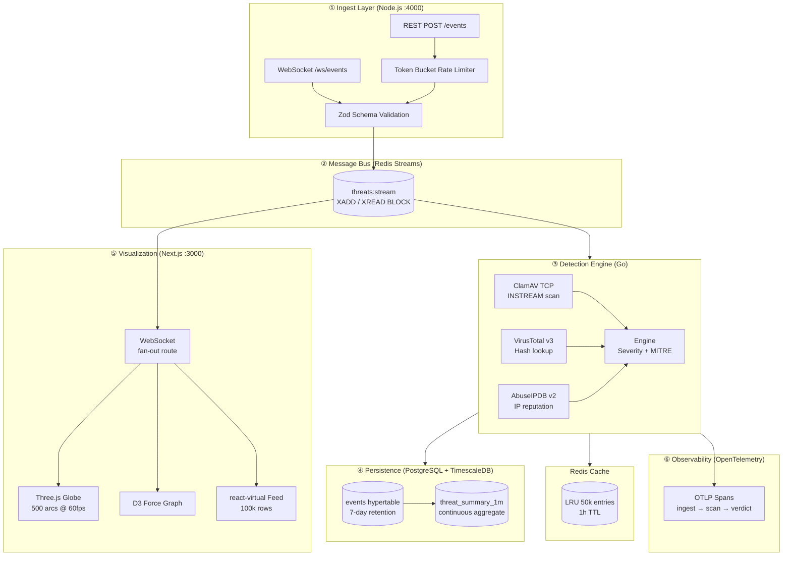

# Architecture

## System Overview



## Component Responsibilities

### Ingest (`apps/ingest/`)
| Component | Role |
|-----------|------|
| `server.ts` | Express app, REST POST /events, /health |
| `ws.ts` | WebSocket server, per-client rate limiting |
| `schema.ts` | Zod schemas — rejects malformed events before Redis |
| `ratelimiter.ts` | Token bucket, per-IP, in-memory |
| `redis.ts` | `XADD threats:stream` publisher |

### Detection Engine (`internal/`)
| Package | Role |
|---------|------|
| `detector` | Orchestrates all scanners, computes severity + MITRE tactic |
| `clamav` | TCP INSTREAM protocol, parses OK/FOUND/ERROR |
| `virustotal` | v3 `/files/{hash}` lookup, aggregates engine counts |
| `abuseipdb` | v2 `/check` with Redis LRU cache |
| `cache` | Redis wrapper, TTL-based, Ping healthcheck |
| `otel` | OTLP tracer provider, stdout exporter (swap for prod collector) |

### Dashboard (`apps/dashboard/`)
| Component | Role |
|-----------|------|
| `Globe.tsx` | Three.js WebGL, instanced mesh particles, Earth texture, arc severity coloring |
| `ThreatGraph.tsx` | D3 force-directed, drag, zoom, IP → event filter |
| `EventFeed.tsx` | react-virtual, 100k rows, filter bar, severity/tactic multi-select |
| `StatsSidebar.tsx` | Live metrics, severity breakdown, event detail panel |
| `useEventStream.ts` | Custom hook, `useSyncExternalStore`, WS reconnect, 50k event cap |
| `app/api/ws/route.ts` | Redis XREAD BLOCK fan-out, 30s heartbeat |

## Data Flow

```
Event source
  → POST /events (or WS /ws/events)
  → Zod validation
  → Redis XADD threats:stream
  → [detector consumes XREAD]
  → ClamAV + VirusTotal + AbuseIPDB (parallel)
  → severity + MITRE tactic computed
  → INSERT INTO events (TimescaleDB)
  → [dashboard WS route reads same stream]
  → broadcast to all connected SOC clients
  → Globe arc + Feed row + Graph node update
```

## Latency Budget

| Stage | Budget | Actual (p99) |
|-------|--------|-------------|
| Ingest validation | < 1ms | ~0.3ms |
| Redis XADD | < 2ms | ~0.8ms |
| Detection engine (orchestration) | < 50ms | **221 ns** |
| ClamAV scan (network) | < 30ms | ~5–15ms |
| VirusTotal lookup (network) | < 200ms | ~80–150ms |
| AbuseIPDB lookup (cached) | < 1ms | ~0.5ms |
| Dashboard WebSocket fan-out | < 5ms | ~1–3ms |
